<p align="center">
  
</p>

# SkillZone

A modern e-learning platform built with Flutter, featuring a clean and intuitive interface for an enhanced learning experience.

---
⭐️ If you found this project helpful, please give it a star!

## 🙌 Special Thanks

- **Backend Developer**: [Abdallah Wassim Meftah](https://github.com/abdallah-mft) - Nta Sahbi w vrai les hommes 😂.
- **Project Supervisor**: [Mdm Lydia Imene Allou](https://github.com/lydia-imene-allou) - for guidance and invaluable insights throughout the development process.

## 💡 Project Concept

SkillZone introduces an innovative approach to e-learning through a unique points-based progression system:

### Points & Skills System
- 🎯 **Dual Learning Path**: The platform distinguishes between Soft Skills and Hard Skills courses
- 🆓 **Free Soft Skills**: Access to comprehensive soft skills courses (leadership, communication, etc.) at no cost
- 💰 **Premium Hard Skills**: Technical courses (programming, design, etc.) are unlocked using points
- ⭐ **Points Economy**: 
  - Earn points by completing soft skills courses
  - Use accumulated points to unlock premium hard skills content
  - Progress through different levels (Rookie → Explorer → Achiever → Master → Expert)
- 🏆 **Level System**: Track your learning journey through achievement badges and level progression

This gamified approach encourages users to develop a well-rounded skill set, recognizing the importance of both technical expertise and interpersonal abilities in professional growth.

## 🚧 Development Status
Some features might be incomplete or subject to change as development progresses.

## 📱 Screenshots

### 🟡 Onboarding Flow
The onboarding experience introduces new users to SkillZone's unique learning approach and value proposition, guiding them through the platform's core concepts before registration.

<table>
  <tr>
    <td align="center">
      <strong>Onboarding</strong><br><br>
      
    </td>
    <td align="center">
      <strong>Welcome</strong><br><br>
      
    </td>
  </tr>
</table>

### 🔐 Authentication
Our streamlined authentication process includes account creation, email verification, and personalization steps to tailor the learning experience to each user's preferences and goals.

<table>
  <tr>
    <td align="center">
      <strong>Login</strong><br><br>
      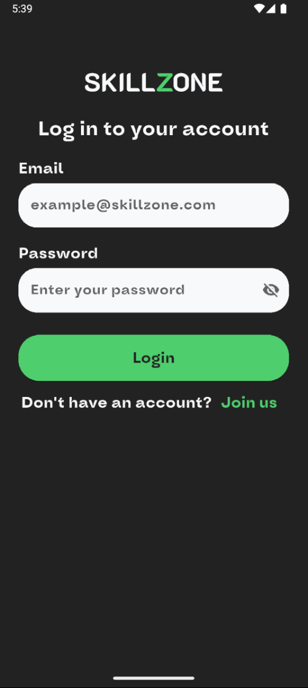
    </td>
    <td align="center">
      <strong>Signup</strong><br><br>
      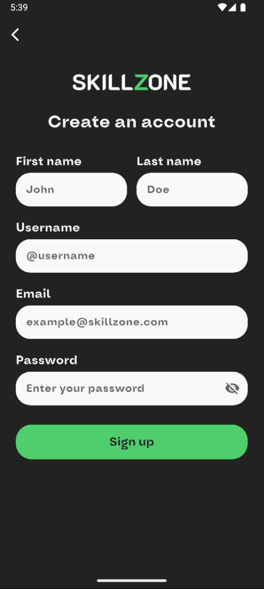
    </td>
    <td align="center">
      <strong>Email Verification</strong><br><br>
      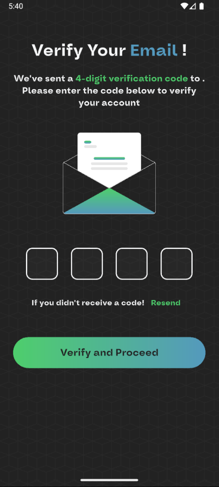
    </td>
  </tr>
  <tr>
    <td align="center">
      <strong>Account Type</strong><br><br>
      
    </td>
    <td align="center">
      <strong>Interests</strong><br><br>
      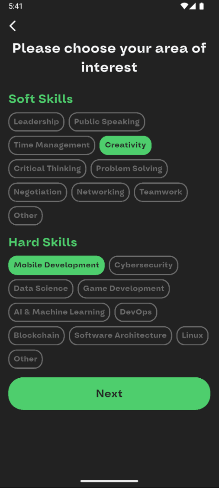
    </td>
  </tr>
</table>

### 🏠 Main App Screens
The core app experience features a clean, intuitive interface with personalized content recommendations, profile management, and progress tracking to keep users engaged and motivated.

<table>
  <tr>
    <td align="center">
      <strong>Home</strong><br><br>
      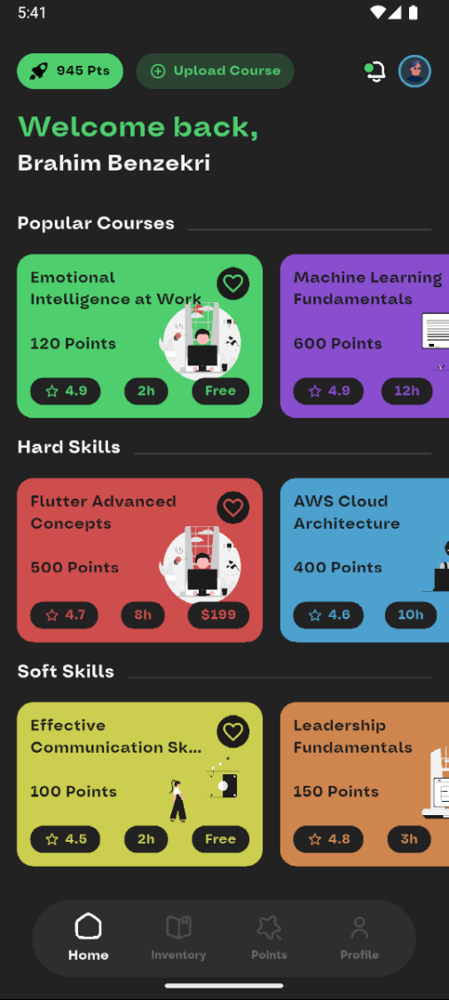
    </td>
    <td align="center">
      <strong>Profile</strong><br><br>
      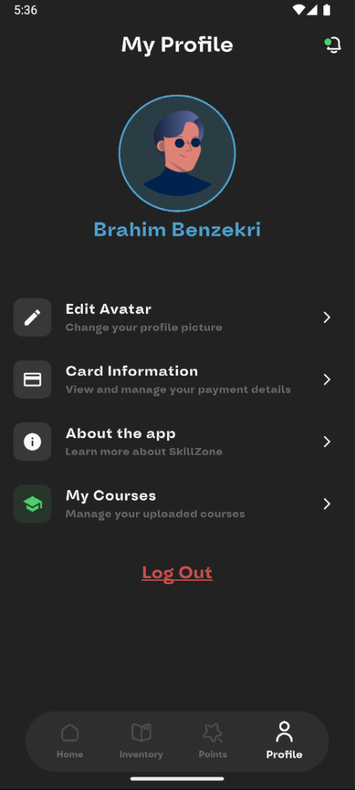
    </td>
    <td align="center">
      <strong>Edit Avatar</strong><br><br>
      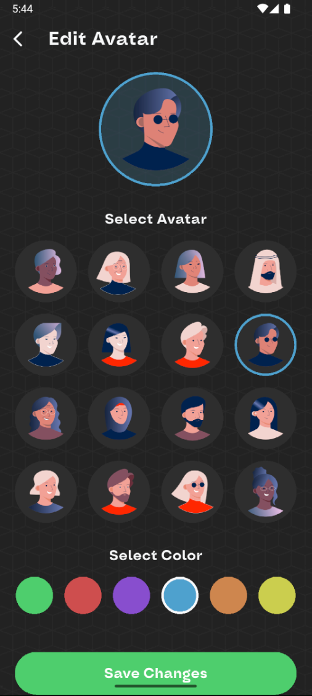
    </td>
  </tr>
  <tr>
    <td align="center">
      <strong>Points & Level</strong><br><br>
      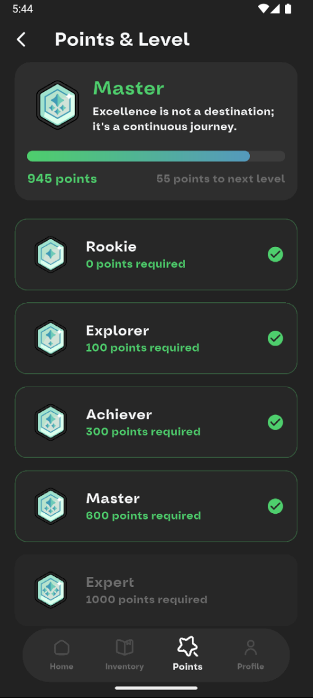
    </td>
    <td align="center">
      <strong>Notifications</strong><br><br>
      
    </td>
  </tr>
</table>

### 📚 Course Types
<table>
  <tr>
    <td align="center">
      <strong>Soft Course</strong><br><br>
      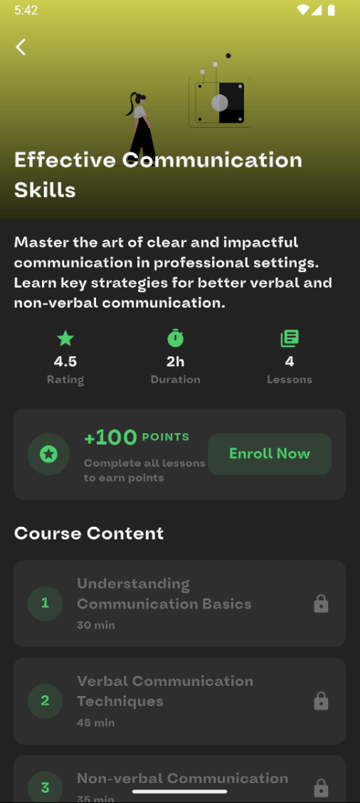
    </td>
    <td align="center">
      <strong>Hard Course</strong><br><br>
      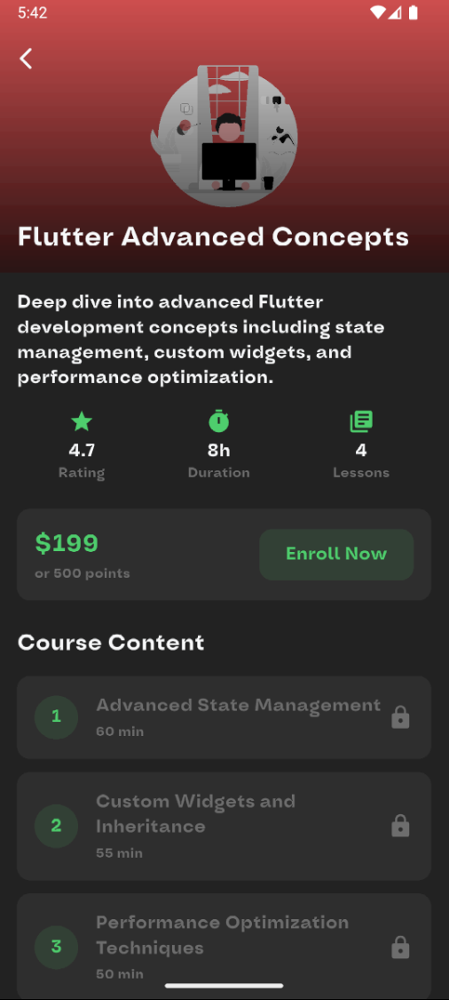
    </td>
  </tr>
</table>

### 🎥 Course Interaction
Our immersive learning experience includes high-quality video lessons, interactive quizzes, and immediate feedback to reinforce knowledge acquisition and track progress toward mastery.

<table>
  <tr>
    <td align="center">
      <strong>Lesson Video</strong><br><br>
      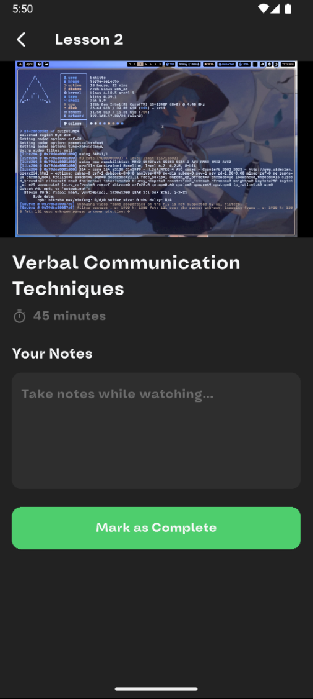
    </td>
    <td align="center">
      <strong>Quiz</strong><br><br>
      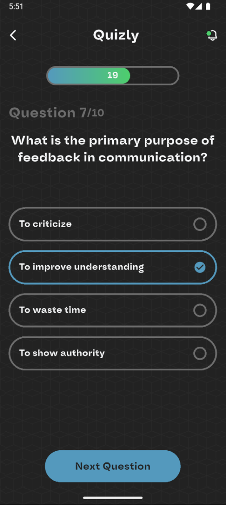
    </td>
    <td align="center">
      <strong>Quiz Results</strong><br><br>
      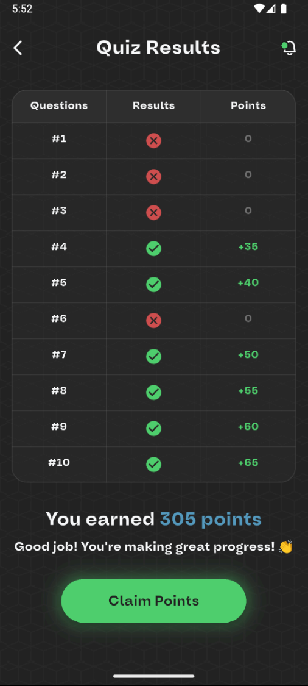
    </td>
  </tr>
</table>

### 📦 Course Management
Users can easily track their learning journey with dedicated sections for enrolled, liked, in-progress, and completed courses, ensuring they never lose sight of their educational goals.

<table>
  <tr>
    <td align="center">
      <strong>Enrolled Courses</strong><br><br>
      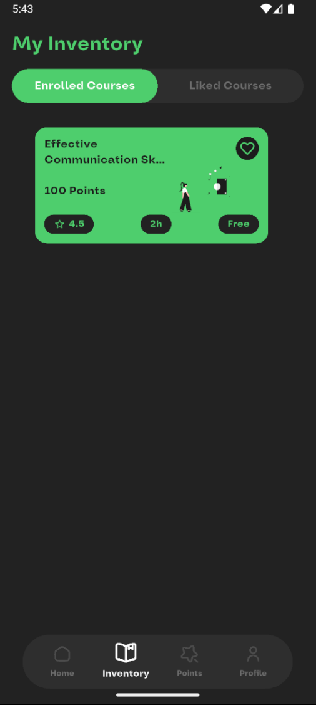
    </td>
    <td align="center">
      <strong>Liked Courses</strong><br><br>
      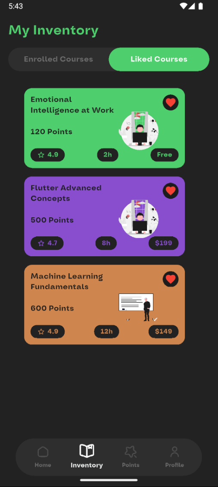
    </td>
    <td align="center">
      <strong>Course In Progress</strong><br><br>
      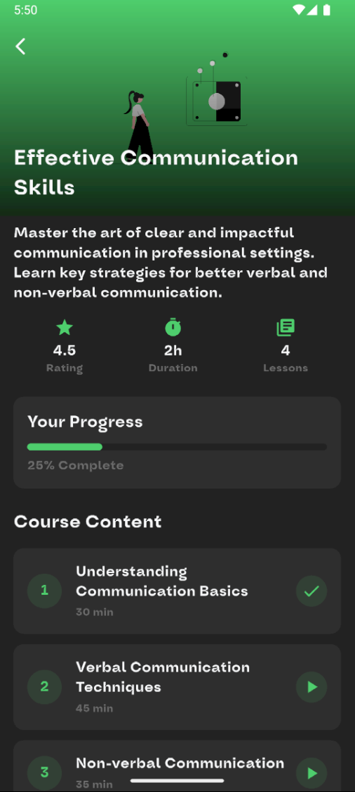
    </td>
  </tr>
  <tr>
    <td align="center">
      <strong>Completed Course</strong><br><br>
      
    </td>
  </tr>
</table>

### 🧑‍🏫 Instructor Features
SkillZone empowers educators with intuitive tools to create and manage courses, upload lessons, and track student engagement, making knowledge sharing accessible to experts in any field.

<table>
  <tr>
    <td align="center">
      <strong>Upload Course</strong><br><br>
      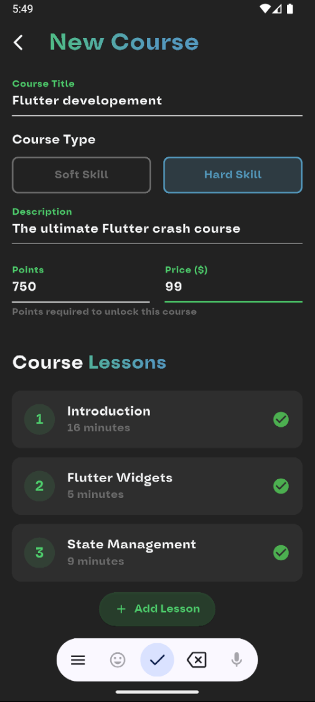
    </td>
    <td align="center">
      <strong>Uploaded Courses</strong><br><br>
      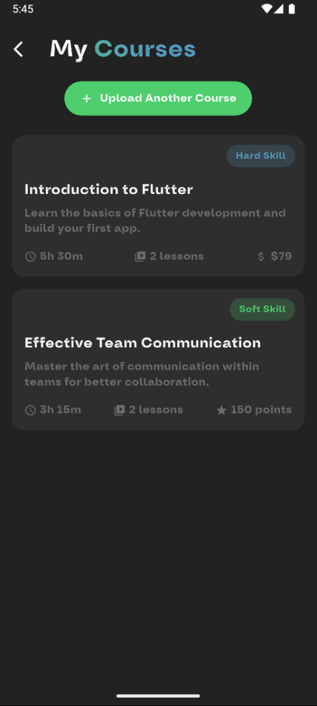
    </td>
  </tr>
</table>

### 💳 Payment
Secure payment processing allows users to purchase additional points or premium subscriptions, with transparent transaction history and card management.

<table>
  <tr>
    <td align="center">
      <strong>Card Information</strong><br><br>
      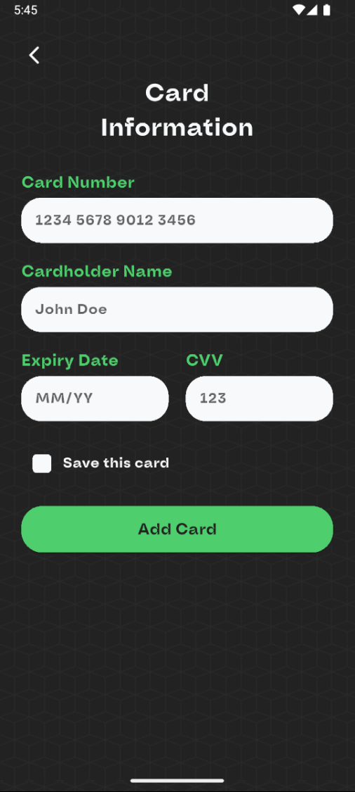
    </td>
  </tr>
</table>

## ✨ Features

Current Implementation:
- 📚 Comprehensive course catalog with distinct soft and hard skills sections
- 🎥 High-quality video lessons with custom player controls
- 👤 User profiles with customizable avatars and progress tracking
- 🎮 Gamified learning with points system and level progression
- 🎨 Modern and intuitive UI design with consistent theming
- 🌙 Custom fonts (Oddval and K2D) for distinctive branding
- 📱 Responsive design for various screen sizes and orientations
- 🌐 Cross-platform support (iOS, Android, Web, macOS, Linux, Windows)
- 👨‍🏫 Instructor tools for course creation and management
- 💳 Secure payment processing for premium content

## 🛠️ Technical Details

### Built With
- Flutter for cross-platform development
- GetX for state management and navigation
- Chewie and Video Player for media playback
- Get Storage for local data persistence
- File Picker and Image Picker for media uploads
- Custom theming and styling throughout

### Font Families
- Oddval (SemiBold, SemiBold Italic) for headings and emphasis
- K2D (ExtraBold) for titles and navigation elements

### Supported Platforms
- iOS
- Android
- Web
- macOS
- Linux
- Windows

## 🚀 Getting Started

### Prerequisites
- Flutter SDK (version 3.5.4 or higher)
- Dart SDK (version 3.5.4 or higher)
- Android Studio / Xcode (for mobile development)
- VS Code or preferred IDE
- Git for version control

### Installation

1. Clone the repository
```bash
git clone https://github.com/yourusername/skillzone.git
```

2. Navigate to project directory
```bash
cd skillzone
```

3. Update flutter to latest version
```bash
flutter upgrade
```

4. Install dependencies
```bash
flutter pub get
```

5. Create a .env file in the root directory with required environment variables
```
API_URL=your_api_url_here
API_KEY=your_api_key_here
```

6. Run the app
```bash
flutter run
```

## 📦 Project Structure

```
lib/
├── assets/
│   ├── fonts/       # Custom fonts (Oddval, K2D)
│   ├── images/      # Static images and illustrations
│   ├── svgs/        # Vector graphics and icons
│   ├── videos/      # Sample video content
│   └── logo/        # App logo in various resolutions
├── features/
│   ├── auth/        # Authentication and user management
│   ├── navigation/  # App navigation and routing
│   ├── courses/     # Course listing and details
│   ├── player/      # Video player and controls
│   ├── quiz/        # Quiz functionality
│   ├── profile/     # User profile management
│   └── payment/     # Payment processing
└── core/
    ├── theme/       # App theming and styling
    ├── models/      # Data models
    ├── services/    # API and backend services
    └── utils/       # Helper functions and utilities
```

## 📄 License

This project is part of academic coursework and is subject to university/college guidelines.

## 🤝 Contributing

As this is a college project in development, contributions are currently limited to project team members. However, feedback and suggestions are welcome:

1. Fork the Project
2. Create your Feature Branch (`git checkout -b feature/AmazingFeature`)
3. Commit your Changes (`git commit -m 'Add some AmazingFeature'`)
4. Push to the Branch (`git push origin feature/AmazingFeature`)
5. Open a Pull Request

## 🙏 Acknowledgments

* [Flutter](https://flutter.dev) - UI toolkit for building natively compiled applications
* [GetX](https://pub.dev/packages/get) - State management, navigation, and dependency injection
* [Chewie](https://pub.dev/packages/chewie) - Video player with customizable controls
* [Flutter SVG](https://pub.dev/packages/flutter_svg) - SVG rendering support
* [Smooth Page Indicator](https://pub.dev/packages/smooth_page_indicator) - Page indicators for onboarding
* [Percent Indicator](https://pub.dev/packages/percent_indicator) - Progress visualization
