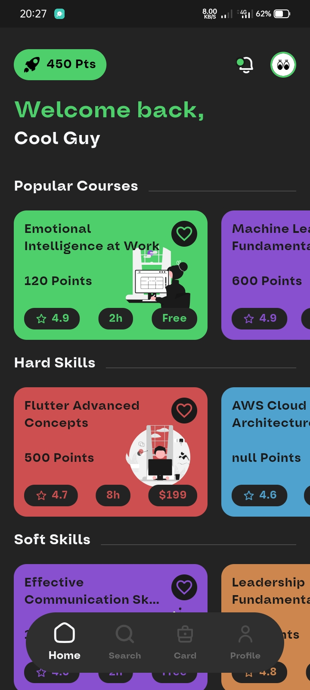
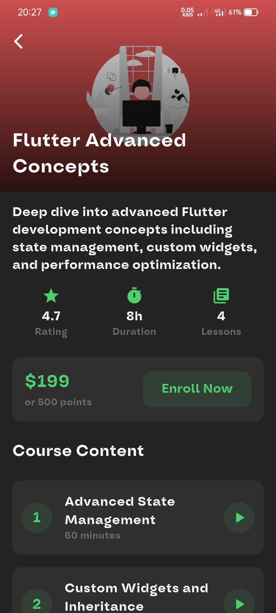
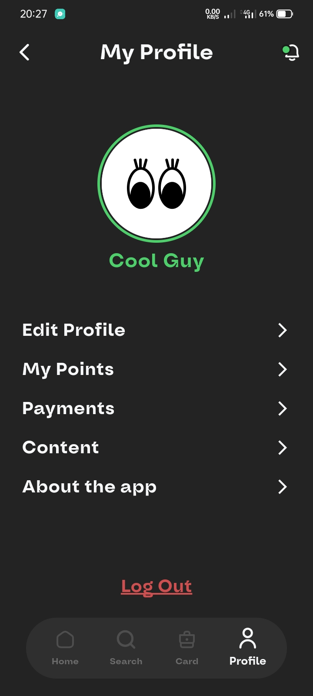
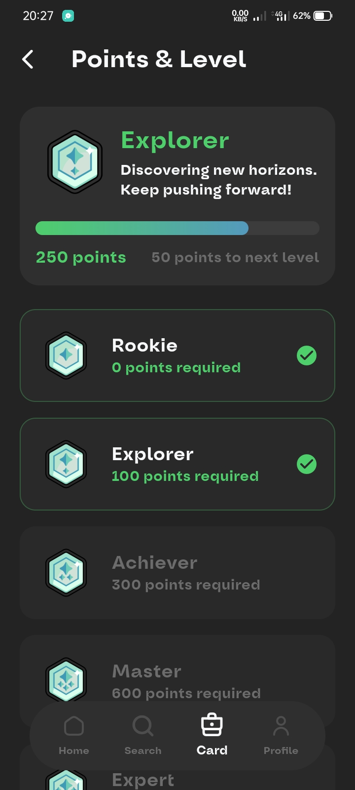
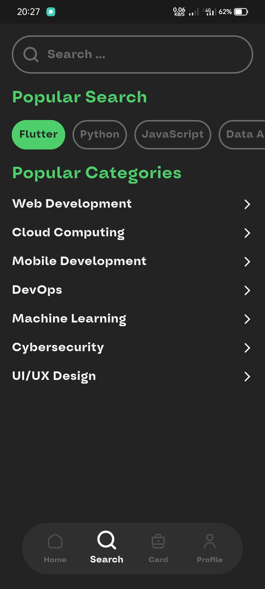

# SkillZone

> 🎓 **College Project Status**: This is an ongoing college project currently in active development. Features and functionality are being continuously added and refined.

A modern e-learning platform built with Flutter, featuring a clean and intuitive interface for an enhanced learning experience.

## 💡 Project Concept

SkillZone introduces an innovative approach to e-learning through a unique points-based progression system:

### Points & Skills System
- 🎯 **Dual Learning Path**: The platform distinguishes between Soft Skills and Hard Skills courses
- 🆓 **Free Soft Skills**: Access to comprehensive soft skills courses (leadership, communication, etc.) at no cost
- 💰 **Premium Hard Skills**: Technical courses (programming, design, etc.) are unlocked using points
- ⭐ **Points Economy**: 
  - Earn points by completing soft skills courses
  - Use accumulated points to unlock premium hard skills content
  - Progress through different levels (Rookie → Explorer → Achiever → Master → Expert)
- 🏆 **Level System**: Track your learning journey through achievement badges and level progression

This gamified approach encourages users to develop a well-rounded skill set, recognizing the importance of both technical expertise and interpersonal abilities in professional growth.

## 🚧 Development Status
Some features might be incomplete or subject to change as development progresses.

## 📱 Screenshots

### Home Screen


### Course Details


### Profile Section


### Points Section


### Search Section


## ✨ Features

Current Implementation:
- 📚 Comprehensive course catalog
- 🎥 High-quality video lessons
- 👤 User profiles and progress tracking
- 🎨 Modern and intuitive UI design
- 🌙 Custom fonts (Oddval and K2D)
- 🎬 Advanced video player with custom controls
- 📱 Responsive design for various screen sizes
- 🌐 Cross-platform support (iOS, Android, Web)

Planned Features:
- 📝 Interactive quizzes
- 🏆 Achievement system
- 📊 Progress analytics

## 🛠️ Technical Details

### Built With
- Flutter
- GetX for state management
- Chewie for video playback
- Custom theming and styling

### Font Families
- Oddval (SemiBold, SemiBold Italic)
- K2D (ExtraBold)

### Supported Platforms
- iOS
- Android
- Web
- macOS
- Linux
- Windows

## 🚀 Getting Started

### Prerequisites
- Flutter SDK
- Dart SDK
- Android Studio / Xcode (for mobile development)
- VS Code or preferred IDE

### Installation

1. Clone the repository
```bash
git clone https://github.com/yourusername/skillzone.git
```

2. Navigate to project directory
```bash
cd skillzone
```

3. Install dependencies
```bash
flutter pub get
```

4. Run the app
```bash
flutter run
```

## 📦 Project Structure

```
lib/
├── assets/
│   ├── fonts/
│   ├── images/
│   ├── svgs/
│   └── logo/
├── features/
│   ├── navigation/
│   ├── courses/
│   └── profile/
└── core/
    ├── theme/
    └── utils/
```

## 📄 License

This project is part of academic coursework and is subject to university/college guidelines.

## 🤝 Contributing

As this is a college project in development, contributions are currently limited to project team members. However, feedback and suggestions are welcome:

1. Fork the Project
2. Create your Feature Branch (`git checkout -b feature/AmazingFeature`)
3. Commit your Changes (`git commit -m 'Add some AmazingFeature'`)
4. Push to the Branch (`git push origin feature/AmazingFeature`)
5. Open a Pull Request


## 🙏 Acknowledgments

* [Flutter](https://flutter.dev)
* [GetX](https://pub.dev/packages/get)

---
⭐️ If you found this project helpful, please give it a star!

> **Note**: This is a college project under development. Some features may be incomplete or subject to change.
